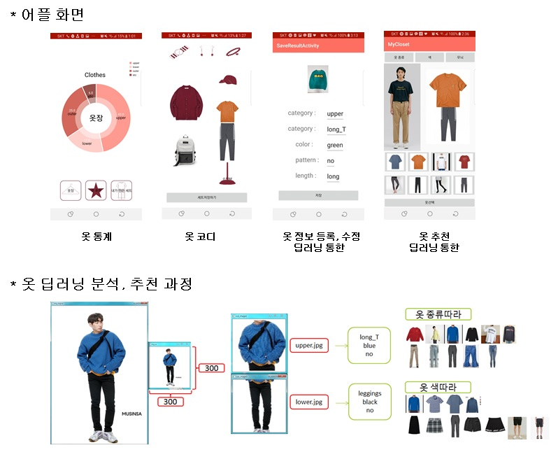

# FashionDeepOOTD2019
# 기간
    6개월 (2019-05-02 ~ 2019-11-12)
# 개요
    사용자의 옷에 대한 정보를 관리하고, 코디를 해볼 수 있는 어플이며, 딥러닝을 통해 옷에 대한
    정보(옷 종류, 색, 패턴)을 추출해 사용자가 갖고있는 옷 중에 유사한 옷을 추천해주는 어플을
    만들고자 했습니다.
    
    
    
# 사용한 라이브러리 및 구현 환경
    1. 구현 환경
        - Window 7                                 - MySQL 8.0
        - opencv 4.1.0                             - 안드로이드 8.0 (Oreo)
        - Spring framework (SpringToolSuite4)      - Flask
        
    2. 사용한 라이브러리 및 기능
        - OpenPose 라이브러리를 사용해 인물의 상하의 정확하게 추출
        - Spring framework를 사용한 안드로이드 - 메인서버 통신 웹서버 구현
        - Flask를 사용한 파이썬파일 구동 서버 – 메인서버 통신 웹서버 구현
        - tensorflow CNN을 사용한 모델로 옷 분류
# 필요 기능과 과정
    1. 안드로이드 UI로 통계 표현하는 기능
        - 자신이 갖고있는 옷들이 몇 개 인지 통계를 보여줍니다.
        
    2. tensorflow CNN을 통한 이미지 분류 기능
        - 데이터 수집 : 크롤링을 통한 쇼핑몰 옷 이미지 크롤링 (각 카테고리별 1000~3000장)
        - 데이터 처리 : 수집된 데이터 분류 및 전처리
        - 딥러닝 모델 구축 및 훈련 : tensorflow를 활용한 CNN 모델 구축
        
    3. Spring framework와 안드로이드 사이 JSON 데이터 통신 기능
        - pring framework로 MVC 패턴을 활용해 웹서버 생성, 안드로이드 요청에 JSON으로 반환
        
    4. Spring framework와 Flask 사이 통신 기능
        - Python 파일(tensorflow 및 이미지 처리)의 빠른 처리를 위한 Flask 웹서버 생성
        
    5. 안드로이드 내부메모리, 카메라 등 디바이스 접근 기능
        - 안드로이드 내부의 메모리나 카메라, 갤러리 어플을 사용한 제어
# tensorflow CNN을 통한 이미지 분류 상세
    1. 데이터 수집
        * 크롤링을 통해 쇼핑몰 홈페이지에서 옷 이미지를 크롤링해 각 카테고리별로 1000~3000장 수집
    2) 데이터 처리
        * 수집된 데이터 분류 및 전처리로 학습데이터 생성
        * 데이터 분류 과정중에 대량의 자료를 직접 분류하기는 불가능하다고 판단, 새로운 학습모델을
          생성해 초기데이터를 분류했습니다.
            ex) 배경이 깔끔한 데이터, 깔끔하지 않은 데이터 학습시켜 자동 분류
            => 80% 정도 정확, 제대로 분류되지 않은 데이터는 직접 분류
        * 데이터 전처리
        - 사람이 찍힌 사진에서 OpenPose를 사용해 골반을 특정해 옷만 분류했습니다.
            - 입력데이터의 resize시 왜곡을 최대한 줄이기 위해 데이터의 크기를 300*300으로 조정했습니다.
    3) 딥러닝 모델 구축 및 훈련
        * tensorflow를 활용한 CNN 모델 구축, 구축한 모델에 수집된 데이터 학습시키기
        * 정확도 향상을 위해 데이터셋 늘리기, 데이터셋 처리하기(배경처리/규격화)
          , epoch 늘리기, learning_rate 조절하기의 과정을 진행했습니다.
          
# 구현 화면

    

# 실행 순서
    1. flask server, spring framework web server 2개의 서버를 실행시킨다.(서버 폴더 경로 값 변경요함.)
    2. DB 구성
    3. 안드로이드의 LoginActivity.java 파일에 자신의 ip를 적고, 디버깅 후 실행.
